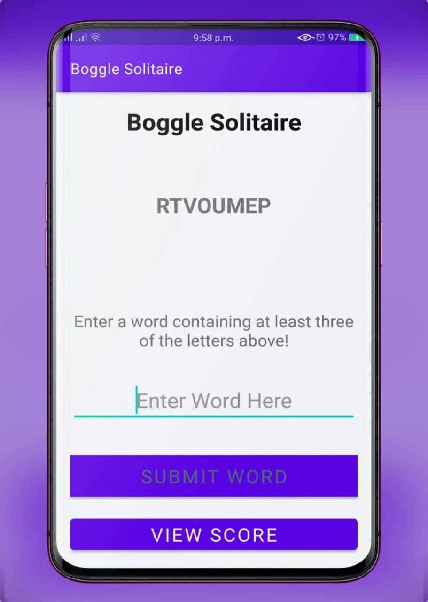

# Boggle-Solitaire
#### September 2nd 2021
#### By **Stephen Njeri**



## Description

```bash

The app randomly generates a string of 8 letters.
The user enters a word that contains at least three of these randomly generated letters.

```
## Technologies Used

* Android studio
* Java 
* Junit


## Installation

*git clone
* `git remote add origin https://github.com/Steve-njeri/Boggle-Solitaire.git` 
* `cd Boggle-Solitaire`

## Launching the Application

```bash
1.Launch the project in Android Studio

```

